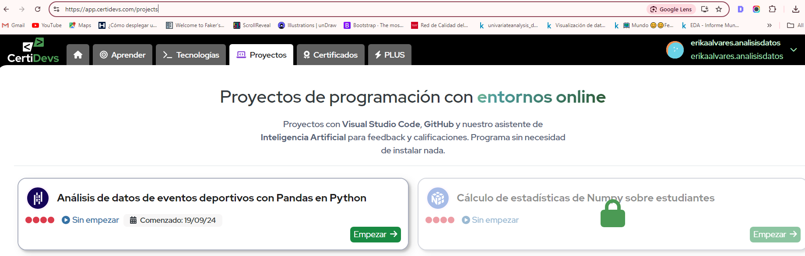
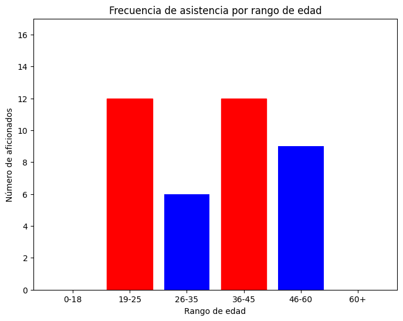

# Análisis de Datos de Eventos Deportivos 🏟️📊

Este proyecto es parte de un reto promovido por **[CertDevs](https://certidevs.com/cursos-programacion)**, donde se aplican técnicas de análisis de datos utilizando Python y la librería **Pandas** para procesar y analizar datos de eventos deportivos, aficionados y promociones publicitarias.

El objetivo es extraer **insights clave** que ayuden a mejorar la planificación de futuros eventos y las estrategias promocionales.



## Descripción 📄
La empresa ha recopilado datos de:
- **Eventos deportivos**: nombre, fecha, ubicación, asistentes.
- **Aficionados**: edad, género, lugar de residencia.
- **Promociones publicitarias**: medio publicitario, presupuesto y duración.

El análisis se centra en responder preguntas de negocio clave, como:
1. ¿Cuál es el evento con mayor asistencia total?
2. ¿Cuál es el rango de edad que asiste más frecuentemente a los eventos?
3. ¿Qué medio publicitario ha generado mayor impacto en términos de asistencia?
4. ¿Cuál es la ubicación de residencia que más aficionados aporta?

## Funcionalidades 🔧
- Limpieza de datos y combinación de DataFrames con Pandas.
- Análisis del evento con mayor asistencia.
- Identificación del medio publicitario más efectivo.
- Visualizaciones con `matplotlib` y `seaborn`.

## Instalación y Uso 🚀
Para ejecutar el proyecto en tu máquina local, sigue estos pasos:

1. Clona el repositorio:
    ```bash
    git clone https://github.com/ea-analisisdatos/analisisdatoseventosdeportivos.git
    ```

2. Instala las dependencias requeridas:
    ```bash
    pip install -r requirements.txt
    ```

3. Ejecuta el script principal:
    ```bash
    python analisis_eventos.py
    ```

### Dataset 📊
El proyecto utiliza tres archivos CSV:

- **eventos.csv**: datos de eventos deportivos (nombre, asistentes, etc.).
- **aficionados.csv**: datos de los aficionados (edad, género, ubicación).
- **promociones.csv**: información de promociones publicitarias (medio, presupuesto, fechas).

### Resultados 🔍
Algunos de los análisis incluyen:
- **Evento con mayor asistencia total**.
- **Rango de edad más frecuente** en los eventos.
- **Impacto de los medios publicitarios** sobre la asistencia.
- **Ubicación que más aficionados aporta**.

Todos los resultados están almacenados en el archivo `reporte_eventos.csv`.

### Visualizaciones 📈
El proyecto genera varias visualizaciones:
1. **Top 5 eventos con mayor asistencia**.
2. **Frecuencia de asistencia por rango de edad**.
3. **Impacto de los medios publicitarios**.

Puedes ver algunos ejemplos a continuación:

#### Gráfica 1: Top 5 eventos con mayor asistencia


#### Gráfica 2: Frecuencia de asistencia por rango de edad


#### Gráfica 3: Impacto de los medios publicitarios


## Exportación de Resultados
El archivo resultante con los análisis se exporta como **`reporte_eventos.csv`** y contiene:
- Nombre del Evento
- Asistentes Totales
- Ubicación de Residencia
- Medio Publicitario
- ID de la Promoción
- Impacto de la Promoción
- Presupuesto de la Promoción
- Fecha de Inicio de la Promoción
- Fecha de Fin de la Promoción

## Contribuciones 🤝
Las contribuciones son bienvenidas. Si tienes sugerencias o encuentras algún error, no dudes en crear un **issue** o **pull request** en el repositorio.

## Autor ✍️
**Erika Alvares**  
Visita mi [web personal](http://www.erikaalvares.es) para más proyectos relacionados con **análisis de datos** y **TICs**.

---

Este proyecto forma parte del reto en [CertDevs](https://certidevs.com/cursos-programacion), una plataforma de formación en informática creada por **[Alan Sastre](https://www.linkedin.com/in/alansastre/)**.

---

## Tecnologías utilizadas:
- **Python**
- **Pandas**
- **Matplotlib**
- **Seaborn**

---

### Notas adicionales:
- Para evitar confusiones con promociones duplicadas, el archivo final incluye columnas adicionales para las fechas de inicio y fin de la promoción, y el ID de la misma.

---
